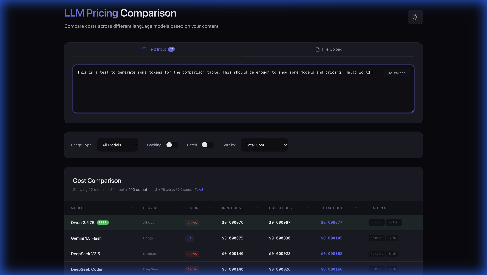

# LLM Pricing Comparison Tool

A modern, real-time tool to compare pricing across various Large Language Models (LLMs) including OpenAI, Anthropic, Google, Mistral, DeepSeek, Qwen, and Moonshot AI (Kimi).

## Features

- **Real-time Cost Estimation**: Calculate costs based on text input or file uploads.
- **PDF Support**: Extract text and tokens directly from PDF documents.
- **Manual Overrides**: Manually set output token targets for precise comparison.
- **Multimedia Models**: Support for ElevenLabs (Audio), Whisper (Audio), and Kling AI (Video).
- **Responsive Design**: Dark/Light mode toggle and mobile-friendly table.
- **Dynamic Normalization**: Compare models using different pricing units (tokens, characters, minutes) in a single view.

## Tech Stack

- React + Vite
- Framer Motion (Animations)
- Recharts (Visualizations)
- PDF.js (PDF Parsing)

## Getting Started

1. Install dependencies: `npm install`
2. Run development server: `npm run dev`
3. Build for production: `npm run build`
